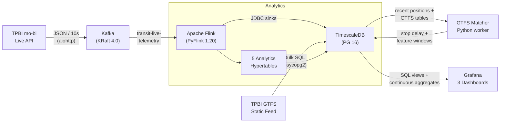

# Real-Time Public Transit Delay Detection for Bucharest

A smart-city stream-processing and prediction system for the Bucharest public transit network. It ingests live GPS vehicle telemetry from the TPBI/mo-bi public API, loads the TPBI GTFS static schedule, computes real-time operational metrics, matches live vehicles to GTFS stops for true schedule delay, and generates route delay predictions from the resulting feature windows.

## Table of Contents

- [Architecture](#architecture)
- [Tech Stack](#tech-stack)
- [Project Structure](#project-structure)
- [Prerequisites](#prerequisites)
- [Getting Started](#getting-started)
- [Data Sources](#data-sources)
- [Metric Definitions And Prediction](#metric-definitions-and-prediction)
- [Grafana Dashboards](#grafana-dashboards)
- [Team Contributions](#team-contributions)

---

## Architecture



**Data flow:** The live producer polls vehicle positions every 10 seconds from the TPBI REST API, sanitizes them, and publishes to a Kafka topic. Apache Flink consumes the stream, writes raw positions, detects bunching and service gaps, computes speed windows, and records telemetry freshness as a separate data-quality metric. GTFS static data is bulk-loaded into TimescaleDB. The `gtfs-matcher` worker reads recent vehicle positions and GTFS tables, writes true stop-level schedule delay events, refreshes route delay metrics, dwell times, geographic hotspots, and feature windows, then the predictor reads those windows for route delay forecasts.

**Current implementation status:** The original GPS timestamp-age proxy has been separated into `transit.telemetry_freshness_metrics`. The operational delay path is now GTFS-based: `gtfs-matcher` populates `transit.stop_delay_events` and refreshes true `transit.route_delay_metrics`, `transit.stop_dwell_times`, `transit.geo_delay_hotspots`, and `transit.realtime_feature_windows`.

---

## Tech Stack

| Component | Technology | Version | Purpose |
|-----------|-----------|---------|---------|
| Message Broker | Apache Kafka (KRaft) | 4.0.2 | Reliable event streaming, no Zookeeper |
| Stream Processor | Apache Flink (PyFlink) | 1.20.3 | Event-time windowed analytics |
| Database | TimescaleDB | latest-pg16 | Time-series storage with hypertables & continuous aggregates |
| Visualization | Grafana | latest | Auto-provisioned dashboards |
| Language | Python | ≥ 3.10 | asyncio producer, GTFS loader, PyFlink jobs |
| Orchestration | Docker Compose | 3.9 | Local infrastructure and GTFS matcher deployment |

---

## Project Structure

```
public-transport-delay-detection/
├── docker-compose.yml              # Infrastructure plus GTFS matcher worker
├── Dockerfile                      # Python worker image for matcher services
├── pyproject.toml                  # Python project metadata & dependencies
├── .env.example                    # Environment variable template
│
├── docs/
│   └── analytics_spec.md           # Data sources, metric contracts, prediction targets
│
├── config/
│   └── settings.py                 # Centralized env-var configuration (frozen dataclasses)
│
├── services/
│   ├── gtfs_ingestion/
│   │   └── loader.py               # Downloads & bulk-loads TPBI GTFS into PostgreSQL
│   ├── gtfs_matching/
│   │   └── matcher.py              # Matches live positions to GTFS stop_times
│   ├── live_producer/
│   │   └── producer.py             # Async Kafka producer polling live vehicle API
│   ├── model_training/
│   │   └── feature_engineer.py      # Feature extraction and target construction
│   ├── flink_jobs/
│   │   └── processing_job.py       # PyFlink pipeline: Kafka → windows → JDBC sinks
│   └── predictor/
│       └── predictor.py            # Batch inference writer for route delay predictions
│
├── sql/
│   ├── init.sql                    # TimescaleDB extension + transit schema bootstrap
│   └── migrations/
│       ├── 001_gtfs_tables.sql     # 7 GTFS relational tables (agency → stop_times)
│       ├── 002_analytics_tables.sql# 5 hypertables with retention policies
│       ├── 003_grafana_views.sql   # 7 dashboard-ready views
│       ├── 004_continuous_aggregates.sql  # 6 auto-refreshing materialized views
│       ├── 005_prediction_tables.sql# delay events, feature store, predictions, hotspots
│       ├── 006_prediction_views.sql # prediction and root-cause Grafana views
│       └── 007_gtfs_matching_runtime.sql # matcher indexes for running DBs
│
├── scripts/
│   ├── migrate.py                  # Migration runner with ledger tracking
│   ├── train_delay_model.py         # Train delay model from feature windows
│   ├── download_flink_jars.{sh,ps1}# Download Flink connector JARs
│   └── submit_flink_job.{sh,ps1}  # Submit PyFlink job to cluster
│
├── grafana/provisioning/
│   ├── datasources/postgres.yml    # Auto-configured TimescaleDB datasource
│   └── dashboards/
│       ├── dashboards.yml          # Dashboard provisioning config
│       └── json/
│           ├── fleet-overview.json     # Live map + KPIs + route status
│           ├── delay-analytics.json    # Delay trends + speed analysis
│           └── anomaly-detection.json  # Bunching + service gaps + reliability
│
├── tests/                          # Unit tests for config, features, matcher, and predictions
└── flink/lib/                      # Flink connector JARs (downloaded via script)
```

---

## Prerequisites

- **Docker** ≥ 24.0 and **Docker Compose** v2
- **Python** ≥ 3.10 (for running services outside containers)
- ~4 GB free RAM (Kafka + Flink + TimescaleDB + Grafana)

---

## Getting Started

### 1. Clone and configure

```bash
git clone <repository-url>
cd public-transport-delay-detection
cp .env.example .env          # edit if you want custom credentials
```

### 2. Download Flink connector JARs

```bash
# Linux / macOS
./scripts/download_flink_jars.sh

# Windows (PowerShell)
.\scripts\download_flink_jars.ps1
```

This downloads the Kafka connector, JDBC connector, and PostgreSQL driver into `flink/lib/`.

### 3. Start the infrastructure

```bash
docker compose up -d
```

Wait for all services to become healthy:

```bash
docker compose ps
```

| Service | Port | URL |
|---------|------|-----|
| Kafka | 9094 | - |
| TimescaleDB | 5433 | `psql -h localhost -p 5433 -U transit -d transit` |
| Flink Web UI | 8081 | http://localhost:8081 |
| Transit UI | 8000 | http://localhost:8000 |
| Grafana | 3000 | http://localhost:3000 (admin / admin) |

### Demo reset / seed script

For a presentation run, use the demo script to prepare the full stack, seed GTFS, wait for live rows, and print the dashboard links.

PowerShell:

```powershell
.\scripts\demo_reset.ps1
```

Bash:

```bash
./scripts/demo_reset.sh
```

For a clean database and fresh Docker volumes:

```powershell
.\scripts\demo_reset.ps1 -Reset -Force
```

```bash
./scripts/demo_reset.sh --reset --force
```

Useful options:
- `-CheckOnly` or `--check-only` prints the planned phases without changing anything.
- `-ReloadGtfs` or `--reload-gtfs` forces the GTFS loader even when routes already exist.
- `-SkipFlinkSubmit` or `--skip-flink-submit` avoids submitting another Flink job if one is already running.
- `-TimeoutSeconds 1200` or `--timeout-seconds 1200` gives slow laptops more time to collect live rows.

### 4. Install Python dependencies

```bash
pip install -e ".[dev]"
```

### 5. Run database migrations

```bash
python scripts/migrate.py
```

This applies all SQL migrations in order: GTFS tables, analytics hypertables, Grafana views, continuous aggregates, prediction tables, prediction views, and matcher runtime indexes. Use `--status` to check what's applied, `--dry-run` to preview.

### 6. Load GTFS static data

```bash
python -m services.gtfs_ingestion.loader
```

Downloads the TPBI Bucharest Region GTFS feed (~8.7 MB) and bulk-loads 7 tables (agencies, routes, stops, trips, stop_times, calendar, shapes).

### 7. Start the live Kafka producer

```bash
python -m services.live_producer.producer
```

Polls `https://maps.mo-bi.ro/api/busData` every 10 seconds and publishes sanitized vehicle positions to the `transit-live-telemetry` Kafka topic.

### 8. Submit the Flink processing job

```bash
# Linux / macOS
./scripts/submit_flink_job.sh

# Windows (PowerShell)
.\scripts\submit_flink_job.ps1
```

This installs PyFlink in the JobManager container, copies connector JARs, and submits the processing pipeline. Monitor it at http://localhost:8081.

### 9. Run the GTFS matcher

Start or refresh the GTFS matcher first so `transit.stop_delay_events` and `transit.realtime_feature_windows` are populated from the live feed and GTFS schedules:

```bash
docker compose up -d --build gtfs-matcher

# or run one local cycle after migrations, GTFS load, producer, and Flink are active
python -m services.gtfs_matching.matcher --once
```

For continuous local execution outside Docker, omit `--once`.

### 10. Train the delay model (after feature windows exist)

```bash
pip install -e ".[ml]"
python scripts/train_delay_model.py --days 30
```

The model trains from `transit.realtime_feature_windows` and writes a versioned artifact to `models/delay_model.joblib` by default.

### 11. Run prediction inference

```bash
python -m services.predictor.predictor --once

# or run it continuously in Docker
docker compose up -d --build delay-predictor
```

This loads the trained model when `models/delay_model.joblib` exists. Before enough future-labeled windows exist for supervised training, it falls back to a warm-start baseline built from current GTFS delay, speed, bunching, service-gap, freshness, dwell, and hotspot features, then writes forecasts to `transit.route_delay_predictions`.

### 12. Open Grafana

Navigate to http://localhost:3000. Local anonymous Viewer access is enabled for dashboards, and four dashboards are auto-provisioned under **Transit Dashboards**.

Open the new GTFS and prediction dashboard directly at http://localhost:3000/d/gtfs-delay-predictions/gtfs-delay-and-predictions.

### 13. Open the stop-to-stop trip planner

Navigate to http://localhost:8000 to open the map UI. It shows GTFS stops/stations in Bucharest, lets you select an origin, destination, and departure time, then returns scheduled public-transit itineraries with direct trips or one transfer.

---

## Data Sources

### GTFS Static Feed
- **Provider:** TPBI (Transportul Public Bucuresti-Ilfov)
- **URL:** `https://gtfs.tpbi.ro/regional/BUCHAREST-REGION.zip`
- **Contents:** 199 routes, 4,552 stops, 61,438 trips, 404 shapes
- **Agencies:** STB SA, STV SA, STCM, METROREX SA, Regio Serv Transport
- **Format:** Standard GTFS ZIP containing CSV files such as `agency.txt`, `routes.txt`, `stops.txt`, `trips.txt`, `stop_times.txt`, `calendar.txt`, and `shapes.txt`
- **Ingestion mode:** Batch download and bulk insert into PostgreSQL/TimescaleDB
- **Use in analytics:** planned schedule, trip and stop matching, route type analysis, route geometry, and prediction context

### Live Vehicle Positions API
- **URL:** `https://maps.mo-bi.ro/api/busData`
- **Auth:** None required (public open-data endpoint)
- **Format:** JSON array of vehicle objects with GPS coordinates, route, direction, agency, trip start time, and vehicle timestamp
- **Update frequency:** Polled every 10 seconds
- **Ingestion mode:** Live REST polling converted into a Kafka stream. It is not an offline log-file input.
- **Kafka schema:** `vehicle_id`, `label`, `license_plate`, `route_id`, `direction_id`, `agency_id`, `trip_start_time`, `latitude`, `longitude`, `timestamp`, `ingested_at`

---

## Metric Definitions And Prediction

The detailed metric contract is maintained in [docs/analytics_spec.md](docs/analytics_spec.md). The important distinction is that telemetry freshness and schedule delay are different signals.

| Metric | Question answered | Output |
|--------|-------------------|--------|
| Telemetry freshness | Is the live GPS feed current enough to trust? | `transit.telemetry_freshness_metrics` |
| Stop-level schedule delay | How late or early was a vehicle at a matched GTFS stop? | `transit.stop_delay_events` |
| Route delay | How delayed is a route and direction in the current window? | `transit.route_delay_metrics` |
| Bunching | Are vehicles on the same route too close together? | `transit.bunching_events` |
| Service gaps | Did a route or direction lose visible service coverage? | `transit.service_gap_alerts` |
| Speed | Which routes or segments are moving slowly? | `transit.segment_speed_stats` |
| Dwell time | How long do vehicles remain near stops? | `transit.stop_dwell_times` |
| Geographic hotspots | Which zones repeatedly accumulate delay and low speed? | `transit.geo_delay_hotspots` |
| Delay prediction | Which routes are likely to be delayed in the next horizon? | `transit.route_delay_predictions` |
| Feature attribution | Which recent features are associated with the prediction? | `transit.delay_feature_attributions` |

Prediction uses the project's own data first: GTFS schedule, live GPS-derived delay, speed, bunching, service gaps, dwell time, route type, time of day, and geographic hotspot score. The first trainable model is a scikit-learn route-delay regressor trained from `transit.realtime_feature_windows` with `scripts/train_delay_model.py`. Until enough future-labeled feature windows are available, the inference runner uses a warm-start baseline so `transit.route_delay_predictions` is populated during the first live session. External data such as weather, incidents, and roadwork can be added later, but it is not required for the core semester project.

The GTFS matcher is the owner of `transit.route_delay_metrics`; Flink now keeps feed freshness in `transit.telemetry_freshness_metrics` instead of writing timestamp-age proxy rows into the delay table.

---

## Grafana Dashboards

All dashboards support template variables for filtering by vehicle type (Bus, Tram, Metro, Trolleybus) and specific route IDs.

### Fleet Overview
Live operational snapshot of the entire transit network.
- **6 KPI stat panels:** active vehicles, active routes, average network delay, average speed, bunching events (30 min), service gaps (60 min)
- **Geomap panel:** real-time vehicle positions on OpenStreetMap centered on Bucharest
- **Route status table:** per-route delay with severity coloring (normal / warning / critical)
- **Speed summary table:** per-route speed with traffic status (normal / slow / congested)
- **Daily fleet activity chart:** vehicle and route counts from continuous aggregates

### Delay Analytics
Historical delay trends and schedule adherence analysis.
- **Hourly delay time-series:** average and peak delay per route with smooth interpolation
- **Vehicle observation counts:** stacked bars showing data volume per route
- **Daily delay bar chart:** top 20 worst-performing routes
- **Daily delay heatmap:** route × day state-timeline with color gradient
- **Hourly speed trends:** per-route speed over time
- **Slowest routes ranking:** bottom 15 routes by average speed

### Anomaly Detection
Route bunching, service gaps, and reliability scoring.
- **Bunching events table:** live alerts with gap duration and color coding
- **Bunching events map:** triangle markers on Bucharest geomap
- **Bunching frequency chart:** hourly stacked bar chart per route
- **Service gap alerts table:** duration severity with rolling 60-min window
- **Reliability score time-series:** gap count per route over time
- **Total gap duration chart:** cumulative downtime per route
- **Most unreliable routes ranking:** top 10 by total service gaps

### GTFS Delay And Predictions
Live GTFS schedule matching, generated feature windows, hotspots, and route forecasts.
- **Runtime status KPIs:** GTFS matches, feature windows, predictions, true delay, predicted delay, and critical route count
- **True delay time-series:** average and p95 GTFS route delay from `transit.route_delay_metrics`
- **Feature window table:** latest generated route features used by prediction
- **Prediction time-series and table:** latest route delay forecasts, risk level, confidence, model version, and target time
- **Hotspot map and table:** geographic delay clusters from `transit.geo_delay_hotspots`

---

## Team Contributions

### Robert Grancsa

Responsible for **infrastructure architecture and database design**. Set up the Docker Compose orchestration with Kafka KRaft, Flink JobManager/TaskManager, TimescaleDB, Grafana, and Python analytics workers, including health checks, volumes, and networking. Designed and implemented all database schemas: the GTFS relational tables (`001_gtfs_tables.sql`), the five analytics hypertables with TimescaleDB retention policies (`002_analytics_tables.sql`), and the seven Grafana-ready SQL views (`003_grafana_views.sql`). Built the Fleet Overview dashboard with the live Geomap panel, KPI stats, and route status tables.

**Key commits:**
- `docs: add project README and proposal`
- `infra: add Docker Compose with Kafka, Flink, TimescaleDB, and Grafana`
- `feat(db): add GTFS static schema migration for transit tables`
- `feat(db): add analytics output tables for Flink pipeline (TimescaleDB hypertables)`
- `feat(db): add Grafana-ready SQL views for dashboard panels`
- `feat(grafana): add Fleet Overview dashboard`

### Ana-Maria Toader (Anatoad)

Responsible for **data ingestion, stream processing, and historical analytics**. Implemented the GTFS static data loader that downloads, parses, and bulk-loads the TPBI feed into PostgreSQL with proper handling of GTFS >24h timestamps. Developed the core PyFlink real-time processing pipeline with event-time watermarks, tumbling-window aggregations, temporal self-joins for bunching detection, and JDBC sinks. Created the TimescaleDB continuous aggregates for hourly and daily historical trend rollups. Built the Delay Analytics dashboard with time-series, heatmaps, and speed analysis panels.

**Key commits:**
- `chore: add .gitignore for Python, Docker, and IDE artifacts`
- `infra: add Grafana datasource and dashboard provisioning`
- `feat(ingestion): add GTFS static data loader for TPBI Bucharest feed`
- `feat(flink): implement PyFlink real-time processing pipeline`
- `feat(db): add TimescaleDB continuous aggregates for historical trends`
- `feat(grafana): add Delay Analytics dashboard`

### Rares-Alexandru Constantin (RaresCon)

Responsible for **real-time data production, deployment tooling, and anomaly visualization**. Built the async Kafka producer that polls the TPBI live vehicle API via aiohttp, sanitizes payloads, and publishes to Kafka with idempotent delivery and LZ4 compression. Created the Flink connector JAR download scripts and the Docker Compose configuration for mounting PyFlink jobs with forwarded environment variables. Developed the SQL migration runner with ledger tracking, dry-run, and status modes. Built the Anomaly Detection dashboard with bunching events, service gap alerts, and reliability scoring panels.

**Key commits:**
- `build: add pyproject.toml and environment config template`
- `infra: add Flink connector JAR download scripts (bash + PowerShell)`
- `feat(producer): add async Kafka producer for live vehicle telemetry`
- `infra: mount Flink jobs volume and forward env vars for PyFlink pipeline`
- `feat(ops): add SQL migration runner with ledger tracking`
- `feat(grafana): add Anomaly Detection dashboard`

### Andrei-Daniel Anghelescu (GemDeKaise)

Responsible for **configuration management, project scaffolding, and operational tooling**. Created the centralized settings module with frozen dataclasses and environment-variable resolution for all service configurations (Postgres, Kafka, Live API, GTFS, Flink). Scaffolded the Python service packages and module structure. Managed build dependencies including adding the `requests` library for GTFS download support. Created the Flink job submission scripts for both bash and PowerShell. Fixed the Grafana datasource UID provisioning for dashboard cross-references.

**Key commits:**
- `feat: add centralized settings module with env-var config`
- `chore: scaffold service packages for ingestion, producer, and Flink jobs`
- `build: add requests dependency for GTFS download`
- `ops: add Flink job submission scripts (bash + PowerShell)`
- `fix(grafana): add UID to datasource provisioning for dashboard references`
